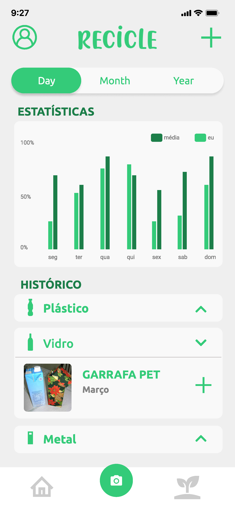
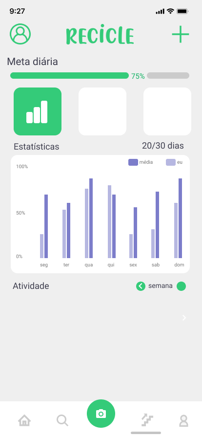
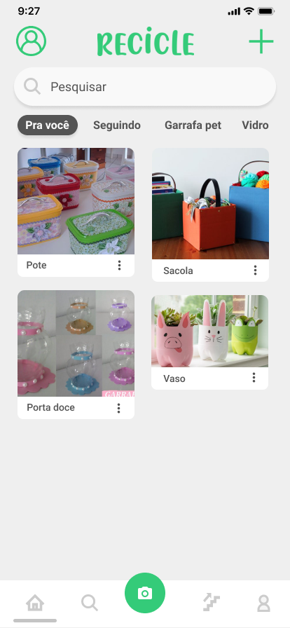

<h3 align="center">
    
    <br><br>
    <b>Help save the environment</b>  
    <br>
</h3>

# Index

- [About](#about)
- [Tecnology](#tecnology)
- [How to use](#como-usar)
- [How to contribute](#how-to-contribute)

<a id="about"></a>

## :bookmark: About

The <strong>Recicle</strong> is an app to help raise awareness about the impacts of waste on the environment.

This application has four main focuses to help people to preserve the environment: identification of garbage by image processing, tips for recycling and reusing garbage, consultation of nearby collection points and visualization of personal progress and impact caused.

<a id="tecnology"></a>

## :rocket: Tecnology

The project was developed using the following technologies

- [Javascript](https://www.javascript.com/)
- [Node.js](https://nodejs.org/en/)
- [React Native](https://reactnative.dev/)
- [Firebase](https://firebase.google.com/)
- [IBM Cloud](https://cloud.ibm.com/)

## :heavy_check_mark: :iphone: Mobile

- The layout is avaible on **[Figma](https://www.figma.com/file/htfz6p9TWQs0LnhVRByEqp/Recicle?node-id=21%3A26)**;

<h1 align="center">
    
     
    <br>
    
</h1>

<a id="como-usar"></a>

## :fire: How to use

- ### **Requeriments**

  - It is **necessry** to have the **[Node.js](https://nodejs.org/en/)** instaled in the PC.
  - Also, it is **needed** to have ter um a package manager be the **[NPM](https://www.npmjs.com/)** or the **[Yarn](https://yarnpkg.com/)**.
  - Lastly it is **essential** to have an account on **[Firebase](https://firebase.google.com/)** to create your own database.

1. Make a clone :

```sh
  $ git clone https://github.com/carolquiterio/recicle.git
```

2. Execute the aplication:

```sh
  # Install the dependencies
  $ npm install

  # Start the aplication
  $ cd mobile
  $ npx start
  $ npx react-native run-android


```

<a id="how-to-contribute"></a>

## 🤔 How to contribute

- Fork this repository;
- Create a branch with your feature: `git checkout -b my-feature`;
- Make a commit with your changes: `git commit -m 'feat: My new feature'`;
- Make a push to your branch: `git push origin my-feature`.

After the merge of your pull request you can delete your branch.

## :memo: License

This project has the MIT license. See the archive [LICENSE](LICENSE.md) for more details.

<h4 align="center">
    Made with 💜 by <a href="https://www.linkedin.com/in/carolina-quiterio-978419188/" target="_blank">Carol</a>, 
    <a href="https://www.linkedin.com/in/mishelle-sousa-3b8159135/" target="_blank">Mishelle</a> and 
    <a href="https://www.linkedin.com/in/christopher-alexandre-a477b6170/" target="_blank">Chris</a>
</h4>
